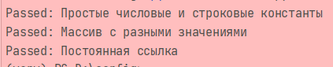

# Config--3-var11

Этот репозиторий содержит Python-скрипты и конфигурационные файлы для проекта. Основная функциональность реализована в скрипте `main.py`, а также имеется дополнительный код для тестирования в файле `test.py`.

## Файлы в репозитории
- `main.py`: Основной скрипт проекта.
- `test.py`: Скрипт для тестирования проекта.
- `input.txt`: Входные данные, используемые Python-скриптами.
- `photo/`: Папка с изображениями, используемыми в проекте.
- `__pycache__/`: Каталог с кешем байт-кода Python.

## Использование
Для запуска проекта убедитесь, что у вас установлен Python. Вы можете выполнить скрипт `main.py`, используя следующую команду:

```bash
venv/Scripts/activate.bat

```


```bash
python main.py input.txt
```
# Конфигурация веб-сервера

var server_host @"192.168.0.1"
var server_port 80
var protocol @"http"


# Конфигурация мобильного приложения
# Параметры интерфейса
var theme @"dark"
var primary_color @"#4CAF50"
var font_size 14
var language @"ru"


# Конфигурация IoT устройства
# Параметры сенсора
var sensor_type @"temperature"
var sensor_min_value -20
var sensor_max_value 50
var sensor_unit @"Celsius"
## Запуск тестов

```commandline
python test.py 

```

